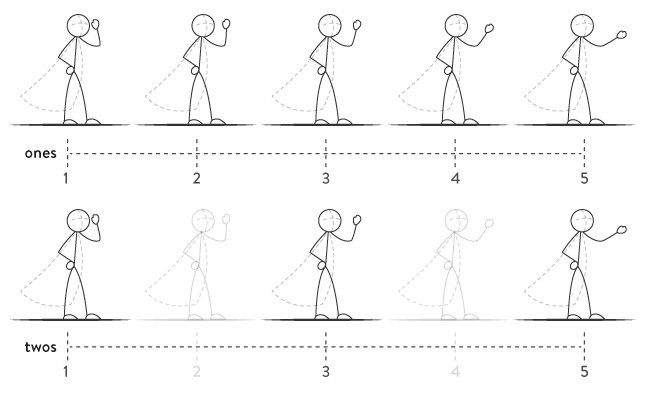
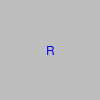
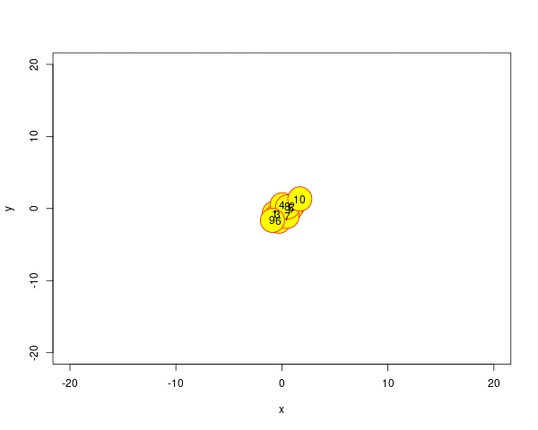
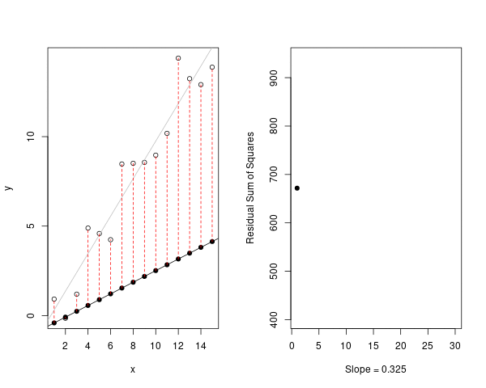
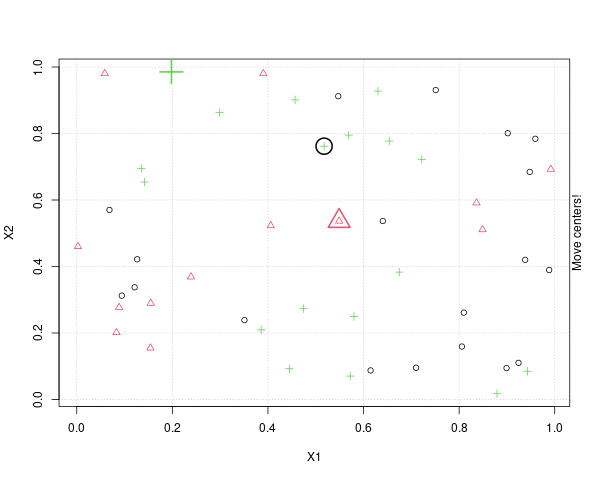
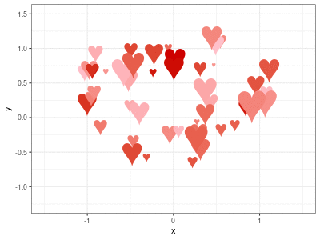
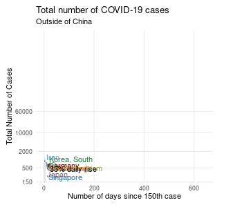
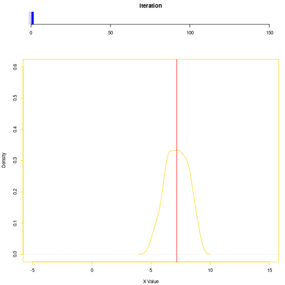
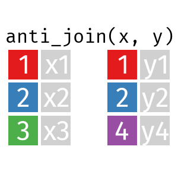
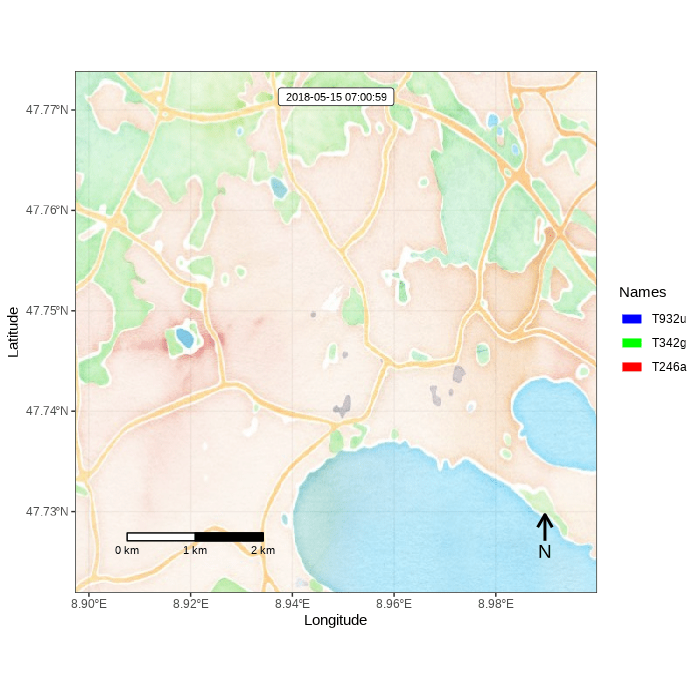

```{r setup, echo = FALSE, cache = FALSE, results = 'hide'}
library(knitr)
options(
  htmltools.dir.version = FALSE, tibble.width = 60, tibble.print_min = 6,
  crayon.enabled = TRUE
)
opts_chunk$set(
  echo = FALSE, warning = FALSE, message = FALSE, comment = "#>",
  fig.path = 'figures/', fig.align = 'center', 
  cache = F, cache.path = 'cache/'
)
```

```{r panelset}
xaringanExtra::use_panelset()
```

.pull-left-middle[
  ## `r fontawesome::fa('lightbulb',height='30px',fill='steelblue')` 一个好的视觉效果能抓住观众的兴趣并给人留下深刻印象
]


.pull-right[
```{r gapminder}
suppressPackageStartupMessages({
  library(gganimate)
  library(gapminder)
  library(tidyverse)  
})

gapminder %>%  
  select(country, pop, year, continent) %>%  
  # for each year we assign a rank
  group_by(year) %>%  
  arrange(year, -pop) %>%  
  # assign ranking
  mutate(rank = 1:n(),
         Value_lbl = paste0(" ",round(pop/1000000))) %>%  
  filter(rank <= 10) ->  
  ranked_by_year

staticplot = ggplot(ranked_by_year, aes(rank, group = country, 
                                              fill = as.factor(country), color = as.factor(country))) +
  geom_tile(aes(y =  pop/2,
                height = pop,
                width = 0.9), alpha = 0.8, color = NA) +
  geom_text(aes(y = 0, label = paste(country, " ")), vjust = 0.2, hjust = 1) +
  geom_text(aes(y=pop,label = Value_lbl, hjust=0)) +
  coord_flip(clip = "off", expand = FALSE) +
  scale_y_continuous(labels = scales::comma) +
  scale_x_reverse() +
  guides(color = "none", fill = "none") + 
  theme(axis.line=element_blank(),
        axis.text.x=element_blank(),
        axis.text.y=element_blank(),
        axis.ticks=element_blank(),
        axis.title.x=element_blank(),
        axis.title.y=element_blank(),
        legend.position="none",
        panel.background=element_blank(),
        panel.border=element_blank(),
        panel.grid.major=element_blank(),
        panel.grid.minor=element_blank(),
        panel.grid.major.x = element_line( size=.1, color="black" ),
        panel.grid.minor.x = element_line( size=.1, color="black" ),
        plot.title=element_text(size=25, hjust=0.5, face="bold", colour="black"),
        plot.subtitle=element_text(size=20, hjust=0.5, face="italic", color="black"),
        plot.caption =element_text(size=12, hjust=0.5, face="italic", color="black"),
        plot.background=element_blank(),
        plot.margin = margin(2,2, 2, 4, "cm"))


anim = staticplot + transition_states(year, transition_length = 4, state_length = 1) +
  view_follow(fixed_x = TRUE) +
  labs(title = '人口数量 : {closest_state}',  
       subtitle  =  "排名前十国家",
       caption  = "人口（百万） | 数据来源: Gapminder data")

anim
```
]

---

class: inverse, center, middle

# 动画原理


---


.left-column[
  ## 视觉残留
]
.right-column[


.center[
### 走马灯

]


晶状体成像 => 感光细胞感光，并且将光信号转换为神经电流 => 传回大脑引起人体视觉


]


---

.left-column[
  ## 视觉残留
  ## 逐帧动画
]
.right-column[

.center[
  
]

]

.footnote[
1. 图片来源：[Persistence of vision: how does animation work?](https://www.futurelearn.com/info/courses/explore-animation/0/steps/12222)
]
---

.left-column[
  ## 视觉残留
  ## 逐帧动画
  ## 关键帧动画
]
.right-column[

.center[
  
]

]
.footnote[
1. 图片来源：[Persistence of vision: how does animation work?](https://www.futurelearn.com/info/courses/explore-animation/0/steps/12222)
]

---

## 常用概念

- 帧 (Frame): 画幅
- 每秒帧数 (Frames per second，FPS)：10帧/秒及以上为流畅的动画

.center[
```{r, out.width = "500px"}
knitr::include_graphics("./figures/flowchart_of_animation.png")
```
]


.footnote[
1. 图片来源：[Animating Your Data Visualizations Like a Boss Using R](https://towardsdatascience.com/animating-your-data-visualizations-like-a-boss-using-r-f94ae20843e3)
]
---

class: inverse, center, middle

# R语言制作动画



---


## 概述

--

#### 编码器 

`ImageMagick` (`GraphicsMagick`)， `Gifski`

--
#### 封装 

`magick`, `gifski`

--

#### 制作动画 

`animation`, `gganimate`

--

#### 制作交互式动画 

`plotly`

---

## magick
.left-column[
  ## 读取图片
]
.right-column[

```r
library(magick)
bigdata <- image_read('./images/bigdata.jpg')
frink <- image_read("./images/frink.png")
logo <- image_read("./images/Rlogo.png")
img <- c(bigdata, logo, frink)
```
```{r magick-demo,echo=F}
library(magick)
bigdata <- image_read('./images/bigdata.jpg')
frink <- image_read("./images/frink.png")
logo <- image_read("./images/Rlogo.png")
img <- c(bigdata, logo, frink)
image_append(image_scale(img, "x200"))
```

]


---

## magick
.left-column[
  ## 读取图片
  ## 制作动画
]
.right-column[

```r
image_animate(image_scale(img, "200x200"), 
              fps = 1, 
              dispose = "previous")
```

```{r magick-animate,echo=F}
image_animate(image_scale(img, "200x200"), 
fps = 1, dispose = "previous")
```
]


---

## magick

.left-column[
  ## 读取图片
  ## 制作动画
  ## 变形
]
.right-column[

```r
newlogo <- image_scale(image_read("./images/Rlogo.png"))
oldlogo <- image_scale(image_read("./images/Rlogo-old.png"))
image_resize(c(oldlogo, newlogo), '200x150!') %>%
  image_background('white') %>%
* image_morph() %>%
  image_animate(optimize = TRUE)
```

```{r magick-morph, echo=F}
newlogo <- image_scale(image_read("./images/Rlogo.png"))
oldlogo <- image_scale(image_read("./images/Rlogo-old.png"))
image_resize(c(oldlogo, newlogo), '200x150!') %>%
  image_background('white') %>%
  image_morph() %>%
  image_animate(optimize = TRUE)
```

]


---

## magick

.left-column[
  ## 读取图片
  ## 制作动画
  ## 变形
  ## 保存图片
]
.right-column[

```r
newlogo <- image_scale(image_read("./images/Rlogo.png"))
oldlogo <- image_scale(image_read("./images/Rlogo-old.png"))
img=image_resize(c(oldlogo, newlogo), '200x150!') %>%
  image_background('white') %>%
  image_morph() %>%
  image_animate(optimize = TRUE)
*image_write(img, "Rlogo.gif")
```
 

]

---

## gifski

一心一意做好将图像帧转换为高质量GIF动画的工作。

.pull-left[

```r
gifski(
* png_files,
  gif_file = "animation.gif",
  width = 800,
  height = 600,
  delay = 1,
  loop = TRUE,
  progress = TRUE
)
```
]

.pull-right[

```r
save_gif(
* expr,
  gif_file = "animation.gif",
  width = 800,
  height = 600,
  delay = 1,
  loop = TRUE,
  progress = TRUE,
  ...
)
```
]

---

## animation


#### 数学和统计学方法的动态展示

.panelset[

.panel[.panel-name[布朗运动]
```{r, out.width = "400px"}

```
]
.panel[.panel-name[最小二乘法]
```{r, out.width = "400px"}

```
]
.panel[.panel-name[Kmeans聚类]
```{r, out.width = "400px"}

```
]
]
 

---

## animation

#### 制作动画的函数

.panelset[

.panel[.panel-name[im.convert()和gm.convert()]

```r
library(animation)
## generate some images
owd = setwd(tempdir())
ani.options(interval = 0.05, nmax = 20)
png("bm%03d.png")
brownian.motion(pch = 21, cex = 5, col = "red", bg = "yellow", 
  main = "Demonstration of Brownian Motion")
dev.off()

## filenames with a wildcard *
im.convert("bm*.png", output = "bm-animation1.gif")
## use GraphicsMagick
gm.convert("bm*.png", output = "bm-animation2.gif")
## or a filename vector
bm.files = sprintf("bm%03d.png", 1:20)
im.convert(files = bm.files, output = "bm-animation3.gif")

```

]

.panel[.panel-name[saveGIF()]
```r
library(animation)
saveGIF({
  brownian.motion(pch = 21, cex = 5, col = "red", bg = "yellow")
}, movie.name = "brownian_motion.gif", interval = 0.1, nmax = 30, 
  ani.width = 600)
```
]

.panel[.panel-name[其他]
- `saveHTML()`
- `saveVideo()`
- `saveLatex()`
- `saveSWF()`
]

]
 
 
---

## gganimate

### 动画语法

* Transitions：定义数据如何伸展变化以及与各种变量（时间、迭代）间的关联

* Views：定义坐标位置比例如何随动画变化

* Shadows：定义如何在给定帧的基础上呈现来自其它帧的数据

* Tweening：定义新数据如何显示，旧数据如何消失

* Rendering：动画渲染方式

---

## gganimate

.pull-left[

```r
ggplot(gapminder, aes(gdpPercap, lifeExp, size = pop, color = country)) +
  geom_point(alpha = 0.7, show.legend = FALSE) +
  scale_color_manual(values = country_colors) +
  scale_x_log10() +
  scale_size(range = c(2, 12)) +
  facet_wrap(~continent) +
  labs(title = "Year:{frame_time}", x = "GDP per capita", y = "life expectancy") +
* transition_time(year) +
* ease_aes("linear")
```
]

.pull-right[
```{r gganimate-demo,echo=F}
ggplot(gapminder, aes(gdpPercap, lifeExp, size = pop, color = country)) +
  geom_point(alpha = 0.7, show.legend = FALSE) +
  scale_color_manual(values = country_colors) +
  scale_x_log10() +
  scale_size(range = c(2, 12)) +
  facet_wrap(~continent) +
  labs(title = "Year:{frame_time}", x = "GDP per capita", y = "life expectancy") +
  transition_time(year) +
  ease_aes("linear")
```
]


---

## Plotly

.pull-left[
```r
suppressPackageStartupMessages({
  library(plotly)
  library(gapminder)
})
df <- gapminder
fig <- df %>%
  plot_ly(
    x = ~gdpPercap,
    y = ~lifeExp,
    size = ~pop,
    color = ~continent,
*   frame = ~year,
    text = ~country,
    hoverinfo = "text",
    type = 'scatter',
    mode = 'markers'
  ) %>% layout(
    xaxis = list(
      type = "log"
    )
  )
fig
```
]

.pull-right[
```{r,cache=FALSE}
suppressPackageStartupMessages({
  library(plotly)
  library(gapminder)
})
df <- gapminder
fig <- df %>%
  plot_ly(
    x = ~gdpPercap,
    y = ~lifeExp,
    size = ~pop,
    color = ~continent,
    frame = ~year,
    text = ~country,
    hoverinfo = "text",
    type = 'scatter',
    mode = 'markers'
  ) %>% layout(
    xaxis = list(
      type = "log"
    )
  )
fig
```
]

---


## Plotly

.pull-left[
```r
fig <- fig %>%
* animation_opts(
*    frame = 1000, 
*    easing = "elastic", 
*    redraw = FALSE
*  )
fig
```
]

.pull-right[
```{r,cache=FALSE}
suppressPackageStartupMessages({
  library(plotly)
  library(gapminder)
})
df <- gapminder
fig <- df %>%
  plot_ly(
    x = ~gdpPercap,
    y = ~lifeExp,
    size = ~pop,
    color = ~continent,
    frame = ~year,
    text = ~country,
    hoverinfo = "text",
    type = 'scatter',
    mode = 'markers'
  ) %>% layout(
    xaxis = list(
      type = "log"
    )
  )
fig <- fig %>%
  animation_opts(
    frame = 1000, easing = "elastic", redraw = FALSE
  )

fig
```
]


---

## 一些例子


.panelset[

.panel[.panel-name[弦图]

.center[ 
```{r, out.width = "300px"}
knitr::include_graphics("./figures/abel-ani10-gf-fix.gif")
```

]
 
.bottom[
作者：Guy Abel 工具：`circlize`+`tweenr`+`magick` 

链接：[Animated directional chord diagrams](https://guyabel.com/post/animated-directional-chord-diagrams)
]
 
]

.panel[.panel-name[心型曲线]

.center[ 

]
 
.bottom[
作者：David Kretch 工具：`ggplot2`+`animation` 

链接：[Show Your Valentine How Much You Care: Create a Statistical Graph](https://www.summitllc.us/blog/show-your-valentine-how-much-you-care-create-a-statistical-graph)
]
]

.panel[.panel-name[COVID-19]

.center[ 

]

.bottom[
作者：Giulia Ruggeri 工具：`gganimate`  

链接：[From static to animated time series: the tidyverse way](https://medium.com/epfl-extension-school/from-static-to-animated-time-series-the-tidyverse-way-d696eb75f2fa)
]

]


.panel[.panel-name[密度函数]

.center[ 
```{r, out.width = "300px"}

```
]

.bottom[
作者：Bryan 工具：`animation`  

链接：[Animations in R – How to Make Animated Graphs](https://www.programmingr.com/content/animations-r/)
]

]


.panel[.panel-name[tidyexplain]

.center[ 

]

.bottom[
作者：Garrick Aden‑Buie 工具：`gganimate`  

链接：[🤹 tidyexplain – Tidy Animated Verbs](https://www.garrickadenbuie.com/project/tidyexplain/)
]

]


.panel[.panel-name[ggpacman]

.center[ 

]

.bottom[
作者：Mickaël Canouil 工具：`gganimate`  

链接：[A ggplot2 and gganimate Version of Pac-Man](https://github.com/mcanouil/ggpacman)
]

]


.panel[.panel-name[moveVis]

.center[ 

```{r, out.width = "300px"}

```

]
 

.bottom[
作者：Jakob Schwalb-Willmann 工具：`ggplot2`+`gifski`  

链接：[moveVis: tools to visualize movement data](https://github.com/16eagle/moveVis)
]

]


]

---

# 如何选择用哪个工具制作动画？

 
### 熟练程度（学习曲线）

gifski, magick, animation, plotly, gganimate 


---

# 如何选择用哪个工具制作动画？
 
### 特点

- 交互性：plotly

- 基础绘图：gifski, magick, animation

- ggplot2绘图：gganimate
 

---

# 总结

### 包外有包

- `anim.plots`: `animation`的封装

- `animint2`, `echarts4r`: javascript

- `tweenr`: 插值


### 3D 动画

- `rgl`


---

class: middle

# 参考资料

- https://cran.r-project.org/web/packages/magick/vignettes/intro.html
- https://ropensci.org/blog/2018/07/23/gifski-release/
- https://gganimate.com/reference/index.html
- https://github.com/thomasp85/tweenr
- https://www.r-graph-gallery.com/animation.html
- https://www.brucemeng.ca/post/animations-in-r/
- https://xiangyun.rbind.io/2021/11/interactive-web-graphics/

---


class: inverse, center, middle

# 谢谢


本幻灯片由 R 包 [**xaringan**](https://github.com/yihui/xaringan) 生成


<!-- https://flowingdata.com/tag/animation/ -->

<!-- https://www.brucemeng.ca/post/animations-in-r/ -->

<!-- https://slackner.com/2018/01/28/options-to-create-animated-plots-in-r/ -->

<!-- https://www.datanovia.com/en/blog/gganimate-how-to-create-plots-with-beautiful-animation-in-r/ -->
